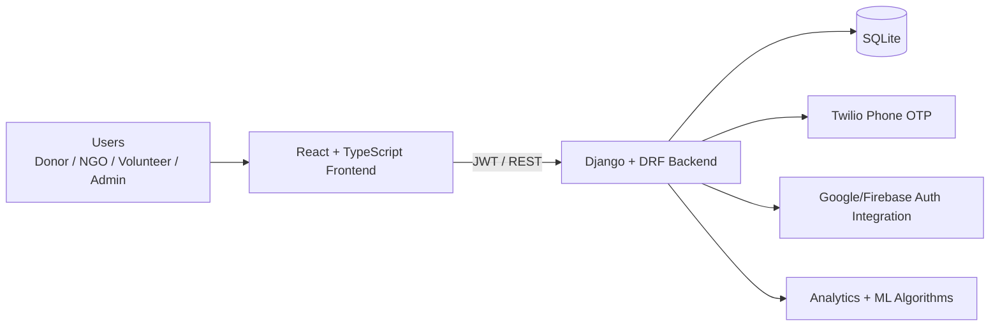
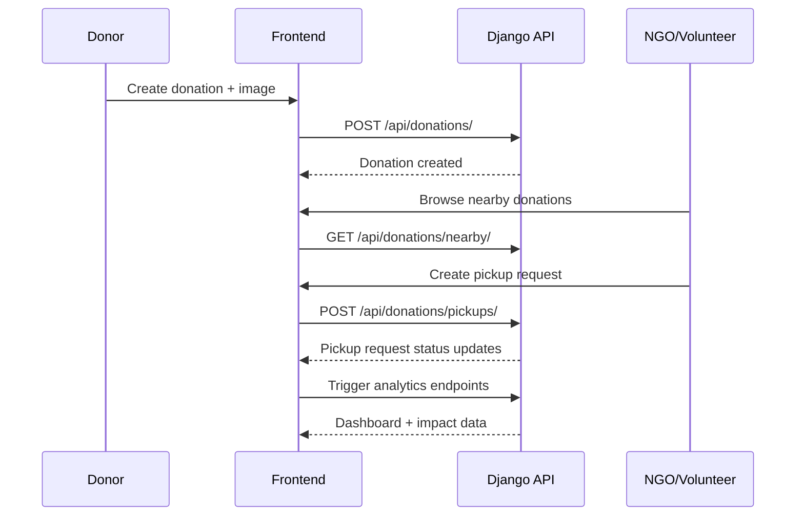

# FoodSave

<p align="center">
	<a href="https://github.com/Rahul-panda564/FoodSave"></a>
	
	
	
	
	
</p>

<p align="center">
	
</p>

## Overview

FoodSave is an AI-enabled food redistribution platform built to reduce food waste and improve last-mile food delivery.

It connects **Donors**, **NGOs**, **Volunteers**, and **Admins** through role-based workflows for donation creation, pickup coordination, delivery tracking, and impact analytics.

---

## Table of Contents

- [Recruiter Snapshot](#recruiter-snapshot)
- [Why FoodSave](#why-foodsave)
- [Role-Based Capabilities](#role-based-capabilities)
- [System Architecture](#system-architecture)
- [Donation Workflow](#donation-workflow)
- [Screenshots](#screenshots)
- [Tech Stack](#tech-stack)
- [Repository Structure](#repository-structure)
- [Quick Start](#quick-start)
- [Environment Variables](#environment-variables)
- [API Overview](#api-overview)
- [Build & Deployment](#build--deployment)
- [Useful Commands](#useful-commands)
- [Roadmap](#roadmap)
- [Security Notes](#security-notes)

---

## Recruiter Snapshot

### Problem

Communities often face a mismatch between **surplus food availability** and **timely redistribution**, leading to avoidable waste and delayed help to beneficiaries.

### Solution

FoodSave provides a role-based digital coordination layer for:

- donation creation and image-based listing,
- nearby discovery and pickup assignment,
- volunteer decision flow,
- admin analytics and impact visibility,
- AI-assisted decisions (food safety, NGO matching, prioritization).

### Engineering Highlights

- Full-stack implementation using **React + TypeScript** and **Django REST Framework**.
- JWT-based secured API flow with phone OTP and federated auth support.
- Modular domain apps (`accounts`, `donations`, `analytics`) with clear separation of concerns.
- Operational dashboards and algorithm endpoints to support data-driven decisions.

### My Key Contributions (Full-Stack)

- Implemented role-protected frontend navigation using `PrivateRoute` and `AdminRoute`, including dedicated flows for dashboard, donations, pickups, analytics, feedback, and AI tools (`/ai-tools`).
- Built and integrated backend modules for `accounts`, `donations`, and `analytics`, including donation + pickup lifecycle APIs (`/api/donations/`, `/api/donations/pickups/`).
- Implemented multi-path authentication: JWT token flow, phone OTP endpoints, profile management, and Google auth integration endpoints.
- Delivered analytics and algorithm APIs for food safety prediction, nearest NGO matching, priority donation queueing, and recommendation workflows.
- Improved project maintainability with cleaner repository structure, deployment artifact organization, and professional documentation for faster recruiter/team onboarding.

### Impact Focus

- Reduces friction between donors and NGOs/volunteers.
- Improves response speed for pickup coordination.
- Creates measurable transparency through leaderboard and impact analytics.

### Interview Talking Points

- Why role-based architecture was chosen and how permissions are enforced.
- Trade-offs between rapid MVP delivery (SQLite/local) and production scalability.
- How algorithm endpoints were integrated into a practical operational workflow.
- What I would harden next for production (CI, observability, containerized deployment, scaling DB).

---

## Why FoodSave

- **Real-world problem focus**: tackles food waste and redistribution inefficiency.
- **End-to-end workflow**: from listing donations to successful pickup and completion.
- **AI-assisted decisions**: food safety prediction, nearest NGO match, and priority queueing.
- **Role-driven platform**: clear permissions and experiences for each actor.
- **Analytics-ready**: dashboard metrics, rankings, and impact views.

---

## Role-Based Capabilities

| Role | Core Actions |
|------|--------------|
| **Donor** | Create donations, upload donation images, track donation status, view leaderboard impact |
| **NGO** | Browse/claim nearby donations, manage pickup flow, monitor deliveries |
| **Volunteer** | Accept/reject pickup requests, handle pickup execution workflow |
| **Admin** | View global dashboard, analytics, feedback, and manage operational visibility |

---

## System Architecture


```mermaid
flowchart LR
	U[Users<br/>Donor / NGO / Volunteer / Admin] --> F[React + TypeScript Frontend]
	F -->|JWT / REST| B[Django + DRF Backend]
	B --> DB[(SQLite)]
	B --> OTP[Twilio Phone OTP]
	B --> GA[Google/Firebase Auth Integration]
	B --> AI[Analytics + ML Algorithms]
```

### Frontend Routing Model

```mermaid
flowchart TD
	A[/home, /login, /register/] --> B[PrivateRoute]
	B --> C[User Dashboard & Donations]
	B --> D[Pickups / Notifications / Profile / Leaderboard]
	B --> E[/ai-tools]
	B --> F[AdminRoute]
	F --> G[/analytics /feedback /admin-donations /admin-pickups]
```

---

## Donation Workflow


```mermaid
sequenceDiagram
	participant D as Donor
	participant FE as Frontend
	participant API as Django API
	participant N as NGO/Volunteer

	D->>FE: Create donation + image
	FE->>API: POST /api/donations/
	API-->>FE: Donation created
	N->>FE: Browse nearby donations
	FE->>API: GET /api/donations/nearby/
	N->>FE: Create pickup request
	FE->>API: POST /api/donations/pickups/
	API-->>FE: Pickup request status updates
	FE->>API: Trigger analytics endpoints
	API-->>FE: Dashboard + impact data
```

---

## Screenshots

### Home Experience


### Donation Experience


---

## Tech Stack

### Frontend

- React 19 + TypeScript
- React Router
- Tailwind CSS
- Axios
- Chart.js + react-chartjs-2
- Leaflet + react-leaflet
- Firebase SDK

### Backend

- Django 6
- Django REST Framework
- Simple JWT
- django-cors-headers
- Pillow
- WhiteNoise
- Twilio SDK
- scikit-learn / NumPy / Pandas

### Data & Infra

- SQLite (default local DB)
- Media storage under `backend/media`

---

## Repository Structure

```text
FoodSave/
├── backend/
│   ├── accounts/                # Authentication, profile, leaderboard, rewards
│   ├── donations/               # Donation and pickup lifecycle APIs
│   ├── analytics/               # Metrics, chart data, AI algorithm endpoints
│   ├── foodsave/                # Django project settings and root URLs
│   ├── manage.py
│   └── requirements.txt
├── frontend/
│   ├── src/                     # React app (pages, components, contexts, services)
│   ├── public/
│   ├── scripts/                 # Build export scripts
│   └── package.json
├── deploy/
│   └── github-pages/            # Generated static artifacts for Pages-style deploys
├── start.bat
├── start.ps1
└── README.md
```

---

## Quick Start

### Prerequisites

- Python 3.10+
- Node.js 18+
- npm

### 1) Backend Setup

```powershell
cd backend
python -m venv venv
.\venv\Scripts\Activate.ps1
pip install -r requirements.txt
python manage.py migrate
python manage.py runserver
```

Backend runs at: **http://localhost:8000**

### 2) Frontend Setup

```powershell
cd frontend
npm install
npm start
```

Frontend runs at: **http://localhost:3000**

### Optional One-Click Startup (Windows)

```powershell
./start.ps1
```

or

```bat
start.bat
```

---

## Environment Variables

### `backend/.env`

```env
SECRET_KEY=your-secret-key
DEBUG=True
ALLOWED_HOSTS=localhost,127.0.0.1
CORS_ALLOWED_ORIGINS=http://localhost:3000,http://127.0.0.1:3000

TWILIO_ACCOUNT_SID=
TWILIO_AUTH_TOKEN=
TWILIO_PHONE_NUMBER=
```

### `frontend/.env`

```env
REACT_APP_API_URL=http://localhost:8000/api
REACT_APP_FIREBASE_API_KEY=
REACT_APP_FIREBASE_AUTH_DOMAIN=
REACT_APP_FIREBASE_PROJECT_ID=
REACT_APP_FIREBASE_STORAGE_BUCKET=
REACT_APP_FIREBASE_MESSAGING_SENDER_ID=
REACT_APP_FIREBASE_APP_ID=
```

---

## API Overview

### Base Groups

- `/api/auth/`
- `/api/donations/`
- `/api/analytics/`
- `/api/token/`
- `/api/token/refresh/`

### Auth (`/api/auth/`)

- `register/`, `login/`, `logout/`
- `profile/`, `upload-profile-image/`, `change-password/`
- `phone/send-otp/`, `phone/verify-otp/`, `phone/register/`, `phone/login/`
- `google/auth/`
- `leaderboard/`, `leaderboard/award-top/`, `prizes/`, `prizes/redeem/`

### Donations (`/api/donations/`)

- `categories/`
- `GET/POST /` donation listing + create
- `upload-image/`, `<id>/`, `my-donations/`, `nearby/`
- `pickups/`, `pickups/<id>/`, `pickups/<id>/decision/`, `pickups/volunteer/`

### Analytics (`/api/analytics/`)

- `dashboard/`, `daily/`, `activities/`
- `feedback/`, `feedback/list/`
- `charts/donations/`
- `top-donors/`, `top-ngos/`, `food-waste-impact/`
- `algorithms/food-safety/`, `algorithms/nearest-ngo/`
- `algorithms/priority-donations/`, `algorithms/recommend-ngos/`
- `algorithms/trigger-notifications/`
- `calculate/`

---

## Build & Deployment

### Frontend Build

```powershell
cd frontend
npm run build
```

### Export Options (from `frontend`)

- `npm run build:pages` → copies build output to `docs/` (GitHub Pages main/docs style)
- `npm run build:root` → copies build output to repository root

### Current Repository Deployment Artifacts

- Static deployment files are currently organized under `deploy/github-pages/`.

---

## Useful Commands

### Backend

```powershell
cd backend
python manage.py check
python manage.py test
```

### Frontend

```powershell
cd frontend
npm run test
npm run build
```

---

## Roadmap

- Add CI pipelines for linting, testing, and build verification
- Publish formal API documentation (OpenAPI/Swagger)
- Expand AI recommendation quality with larger datasets
- Add production-grade deployment docs (Docker + cloud target)
- Improve observability (structured logging + error tracing)

---

## Security Notes

- Keep all credentials in `.env` files only
- Do not commit secrets, tokens, or service account keys
- Rotate compromised credentials immediately
- Use secure `SECRET_KEY` and disable `DEBUG` in production

---

## Contribution

Contributions and improvements are welcome.

If you open a PR, please include:

- concise problem statement
- screenshots for UI changes
- test notes for backend/frontend changes
