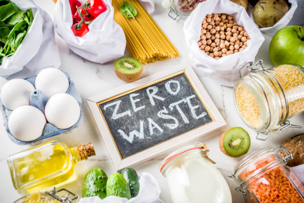

# FoodSave

<p align="center">
	<a href="https://github.com/Rahul-panda564/FoodSave"></a>
	
	
	
</p>

<p align="center">
	
</p>

FoodSave is an AI-powered food redistribution platform that connects Donors, NGOs, Volunteers, and Admins to reduce food waste and improve last-mile delivery.

## Table of Contents

- [Features](#features)
- [Screenshots](#screenshots)
- [Tech Stack](#tech-stack)
- [Project Structure](#project-structure)
- [Quick Start](#quick-start)
- [Environment Variables](#environment-variables)
- [API Groups](#api-groups)
- [Useful Commands](#useful-commands)
- [Security Notes](#security-notes)

## Features

- Role-based workflows (DONOR, NGO, VOLUNTEER, ADMIN)
- Donation lifecycle: create → request → pickup → delivery
- Leaderboard and reward redemption
- Analytics + AI tooling for food safety and matching
- Mobile-friendly navigation and dashboard experience

## Screenshots

### Home Experience



### Donation Experience


## Tech Stack

### Backend

- Django
- Django REST Framework
- Simple JWT
- SQLite (local development)

### Frontend

- React + TypeScript
- Tailwind CSS
- Axios

## Project Structure

```text
FoodSave/
├── backend/
│   ├── accounts/
│   ├── donations/
│   ├── analytics/
│   ├── foodsave/
│   └── manage.py
├── frontend/
│   ├── src/
│   ├── public/
│   └── package.json
├── start.bat
└── start.ps1
```

## Quick Start

### Prerequisites

- Python 3.10+
- Node.js 18+
- npm

### 1) Backend

```powershell
cd backend
python -m venv venv
.\venv\Scripts\Activate.ps1
pip install -r requirements.txt
python manage.py migrate
python manage.py runserver
```

Backend URL: http://localhost:8000

### 2) Frontend

```powershell
cd frontend
npm install
npm start
```

Frontend URL: http://localhost:3000

## Environment Variables

### backend/.env

```env
SECRET_KEY=your-secret-key
DEBUG=True
ALLOWED_HOSTS=localhost,127.0.0.1
CORS_ALLOWED_ORIGINS=http://localhost:3000,http://127.0.0.1:3000
TWILIO_ACCOUNT_SID=
TWILIO_AUTH_TOKEN=
TWILIO_PHONE_NUMBER=
```

### frontend/.env

```env
REACT_APP_API_URL=http://localhost:8000/api
REACT_APP_FIREBASE_API_KEY=
REACT_APP_FIREBASE_AUTH_DOMAIN=
REACT_APP_FIREBASE_PROJECT_ID=
REACT_APP_FIREBASE_STORAGE_BUCKET=
REACT_APP_FIREBASE_MESSAGING_SENDER_ID=
REACT_APP_FIREBASE_APP_ID=
```

## API Groups

- /api/auth/
- /api/donations/
- /api/analytics/

## Useful Commands

### Backend

```powershell
cd backend
python manage.py check
python manage.py test
python manage.py seed_leaderboard_data
```

### Frontend

```powershell
cd frontend
npm run build
```

## Security Notes

- Keep all credentials only in .env files.
- Do not commit production secrets.
- Rotate keys if GitHub secret scanning reports exposure.

---

Contributions and improvements are welcome.