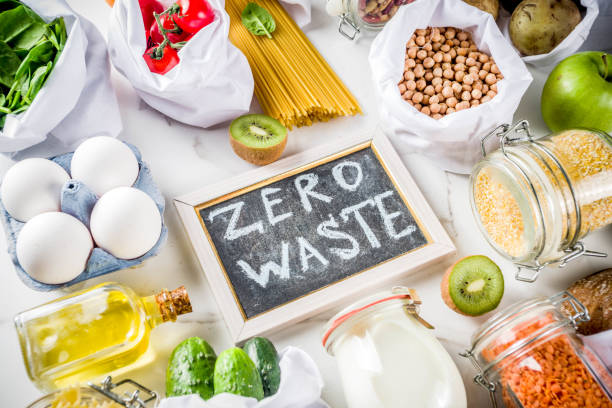
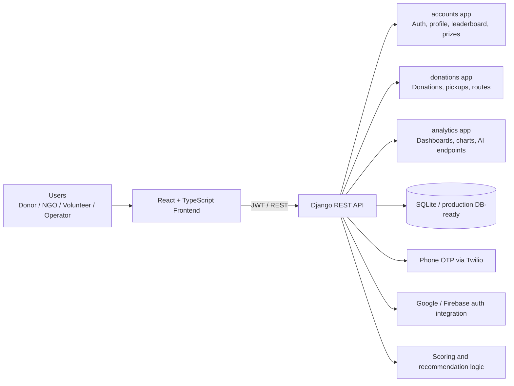
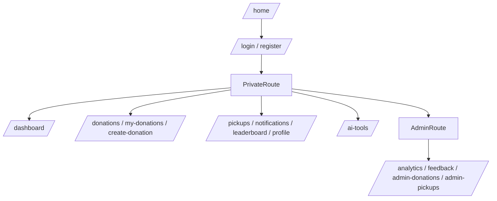
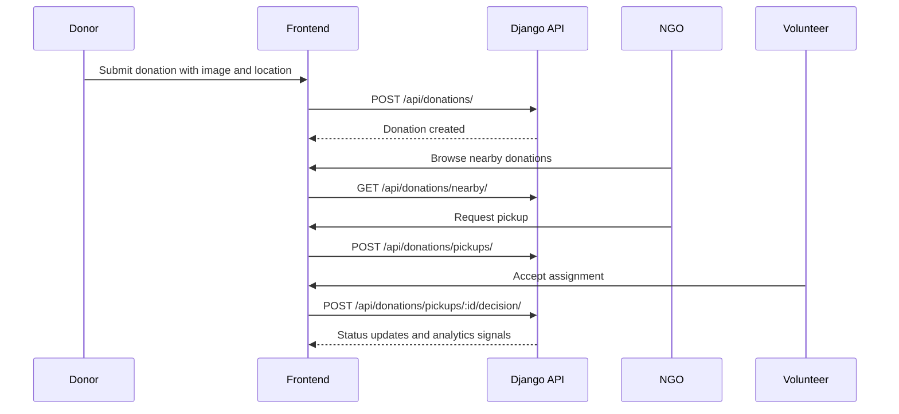

# FoodSave

<p align="center">
	<a href="https://github.com/Rahul-panda564/FoodSave"></a>
	
	
	
	
	
</p>

<p align="center">
	
</p>

## Overview

FoodSave is an AI-assisted food redistribution platform that helps donors, NGOs, volunteers, and platform operators move surplus food to people who can use it before it goes to waste.

The product combines a React + TypeScript frontend with a Django REST backend to support donation creation, pickup coordination, real-time tracking, leaderboard incentives, and analytics-driven decision making.

## At A Glance

| Area | Details |
|------|---------|
| Purpose | Reduce food waste and improve last-mile food redistribution |
| Users | Donors, NGOs, Volunteers, and Admin operators |
| Frontend | React 19, TypeScript, React Router, Tailwind CSS, Framer Motion |
| Backend | Django 6.0.3, Django REST Framework, Simple JWT |
| Intelligence | Food-safety prediction, nearest NGO matching, donation prioritization |
| Visual Assets | Landing-page hero art and modular dashboard interfaces |

## Why It Exists

Food waste and food insecurity often coexist in the same city. The main gap is coordination: food must be listed, matched, assigned, picked up, and delivered quickly enough to remain usable.

FoodSave addresses that gap with:

- role-based workflows for each participant,
- image-backed donation listings,
- nearby matching for pickups,
- volunteer dispatch and status updates,
- analytics dashboards that show impact instead of just activity,
- AI-enabled helpers for food safety and NGO recommendation.

## Core Experience

### Donor Flow

- Create a donation with food details, timing, storage conditions, and pickup location.
- Upload an image to support the listing and improve decision making.
- Track whether the donation is available, assigned, picked up, or completed.

### NGO Flow

- Discover nearby donations and request pickups.
- Manage coordination around food collection and delivery handoff.
- View donation and pickup status from the dashboard.

### Volunteer Flow

- Review pickup opportunities.
- Accept or decline assignments.
- Complete pickup execution and delivery tracking.

### Operator Flow

- View platform-level analytics and donation trends.
- Review feedback and operational signals.
- Use the AI tools page to inspect the recommendation and prioritization layer.

## Architecture


```mermaid
flowchart LR
  U[Users\nDonor / NGO / Volunteer / Operator] --> FE[React + TypeScript Frontend]
  FE -->|JWT / REST| API[Django REST API]
  API --> ACC[accounts app\nAuth, profile, leaderboard, prizes]
  API --> DON[donations app\nDonations, pickups, routes]
  API --> ANA[analytics app\nDashboards, charts, AI endpoints]
  API --> DB[(SQLite / production DB-ready)]
  API --> OTP[Phone OTP via Twilio]
  API --> FIREBASE[Google / Firebase auth integration]
  API --> ML[Scoring and recommendation logic]
```

### Frontend Routing


```mermaid
flowchart TD
  H[/home/] --> A[/login / register/]
  A --> P[PrivateRoute]
  P --> D[/dashboard/]
  P --> N[/donations / my-donations / create-donation/]
  P --> K[/pickups / notifications / leaderboard / profile/]
  P --> T[/ai-tools/]
  P --> R[AdminRoute]
  R --> X[/analytics / feedback / admin-donations / admin-pickups/]
```

## Donation Lifecycle


```mermaid
sequenceDiagram
  participant Donor
  participant Frontend
  participant API as Django API
  participant NGO
  participant Volunteer

  Donor->>Frontend: Submit donation with image and location
  Frontend->>API: POST /api/donations/
  API-->>Frontend: Donation created
  NGO->>Frontend: Browse nearby donations
  Frontend->>API: GET /api/donations/nearby/
  NGO->>Frontend: Request pickup
  Frontend->>API: POST /api/donations/pickups/
  Volunteer->>Frontend: Accept assignment
  Frontend->>API: POST /api/donations/pickups/:id/decision/
  API-->>Frontend: Status updates and analytics signals
```

## Screenshots and Visuals

The codebase currently includes the landing-page hero visual used above. The app also includes rich in-product UI states for:

- donation creation with image preview,
- profile image preview and upload,
- analytics charts and top-entity leaderboards,
- AI tools dashboard with chart and network visualizations,
- role-specific dashboards for donors, NGOs, volunteers, and operators.

If you want this README to include actual UI screenshots from the app shell, add exported page captures into `frontend/src/assets/` and replace or extend the current gallery section.

## Tech Stack

### Frontend

- React 19
- TypeScript
- React Router 7
- Tailwind CSS
- Framer Motion
- Axios
- Chart.js and react-chartjs-2
- Leaflet and react-leaflet
- Firebase SDK

### Backend

- Django 6.0.3
- Django REST Framework
- Simple JWT
- django-allauth
- django-cors-headers
- Pillow
- Twilio
- scikit-learn
- NumPy
- pandas
- WhiteNoise

### Data and Storage

- SQLite for local development
- Media uploads under `backend/media/`
- Static deployment artifacts under `deploy/github-pages/`

## Repository Structure

```text
FoodSave/
├── backend/
│   ├── accounts/      # Authentication, profile, points, leaderboard, prizes
│   ├── donations/     # Donation, pickup, route, and status lifecycle
│   ├── analytics/     # Dashboard, charts, feedback, and AI-style endpoints
│   ├── foodsave/      # Django project settings and root URL routing
│   ├── manage.py
│   └── requirements.txt
├── frontend/
│   ├── src/
│   │   ├── components/
│   │   ├── contexts/
│   │   ├── pages/
│   │   ├── services/
│   │   ├── hooks/
│   │   └── assets/
│   ├── public/
│   ├── scripts/
│   └── package.json
├── deploy/
│   └── github-pages/
├── README.md
└── LICENSE
```

## API Surface

### Root API Groups

- `/api/auth/`
- `/api/donations/`
- `/api/analytics/`
- `/api/token/`
- `/api/token/refresh/`

### Auth API

- `register/`, `login/`, `logout/`
- `profile/`, `upload-profile-image/`, `change-password/`
- `phone/send-otp/`, `phone/verify-otp/`, `phone/register/`, `phone/login/`
- `google/auth/`
- `stats/`, `leaderboard/`, `leaderboard/award-top/`
- `prizes/`, `prizes/redeem/`

### Donations API

- `categories/`
- `GET /` and `POST /` for donations
- `upload-image/`
- `<id>/`
- `my-donations/`
- `nearby/`
- `pickups/`
- `pickups/<id>/`
- `pickups/<id>/decision/`
- `pickups/volunteer/`

### Analytics API

- `dashboard/`
- `daily/`
- `activities/`
- `feedback/`
- `feedback/list/`
- `charts/donations/`
- `top-donors/`
- `top-ngos/`
- `food-waste-impact/`
- `algorithms/food-safety/`
- `algorithms/nearest-ngo/`
- `algorithms/priority-donations/`
- `algorithms/recommend-ngos/`
- `algorithms/trigger-notifications/`
- `calculate/`

## Quick Start

### Prerequisites

- Python 3.10+
- Node.js 18+
- npm

### Backend

```powershell
cd backend
python -m venv venv
.\venv\Scripts\Activate.ps1
pip install -r requirements.txt
python manage.py migrate
python manage.py runserver
```

Backend: `http://localhost:8000`

### Frontend

```powershell
cd frontend
npm install
npm start
```

Frontend: `http://localhost:3000`

### One-Click Startup on Windows

```powershell
./start.ps1
```

or

```bat
start.bat
```

## Environment Variables

### `backend/.env`

```env
SECRET_KEY=your-secret-key
DEBUG=True
ALLOWED_HOSTS=localhost,127.0.0.1
CORS_ALLOWED_ORIGINS=http://localhost:3000,http://127.0.0.1:3000

TWILIO_ACCOUNT_SID=
TWILIO_AUTH_TOKEN=
TWILIO_PHONE_NUMBER=
```

### `frontend/.env`

```env
REACT_APP_API_URL=http://localhost:8000/api
REACT_APP_FIREBASE_API_KEY=
REACT_APP_FIREBASE_AUTH_DOMAIN=
REACT_APP_FIREBASE_PROJECT_ID=
REACT_APP_FIREBASE_STORAGE_BUCKET=
REACT_APP_FIREBASE_MESSAGING_SENDER_ID=
REACT_APP_FIREBASE_APP_ID=
```

## Build and Deployment

### Frontend Build

```powershell
cd frontend
npm run build
```

### Export Targets

- `npm run build:pages` copies the build output to a GitHub Pages-friendly structure.
- `npm run build:root` copies the build output to the repository root.

### Deployment Artifacts

- Static deployment output is currently organized under `deploy/github-pages/`.

## Useful Commands

### Backend

```powershell
cd backend
python manage.py check
python manage.py test
```

### Frontend

```powershell
cd frontend
npm run test
npm run build
```

## Roadmap

- Add CI for linting, testing, and build verification
- Publish OpenAPI or Swagger documentation
- Expand AI recommendation quality with larger datasets
- Add containerized deployment documentation
- Improve observability with structured logging and tracing

## Security Notes

- Keep credentials in `.env` files only
- Do not commit secrets, tokens, or service account keys
- Rotate compromised credentials immediately
- Disable `DEBUG` in production

## Contribution

Contributions and improvements are welcome.

If you open a PR, please include:

- concise problem statement
- screenshots for UI changes
- test notes for backend/frontend changes
