# 🍎 FoodSave – AI-Based Food Wastage Reduction System

> **"Bridging the gap between surplus food and hunger using Artificial Intelligence."**

## 📖 Project Overview
**FoodSave** is a full-stack web application designed to minimize food wastage in the hospitality sector. It connects food donors (Hotels, Restaurants) with charitable organizations (NGOs) in real-time.

Unlike standard donation platforms, **FoodSave integrates a Machine Learning model (Random Forest)** to predict the "Safe Consumption Time" (Shelf Life) of cooked food based on environmental factors like temperature and preparation time. This ensures that only safe, hygienic food is distributed to the needy.

---

## 🚀 Key Features

### 🏨 For Donors (Hotels/Restaurants)
*   **Easy Listing:** Post surplus food details (Type, Quantity, Cooked Time).
*   **AI Safety Check:** Automated calculation of expiry time. The system rejects entries predicted to spoil before pickup.
*   **Impact Dashboard:** Gamified tracking of "Total KGs Saved" and "People Fed".

### 🤝 For NGOs (Receivers)
*   **Real-Time Feed:** View available food listings sorted by proximity and expiry time.
*   **Safety Indicators:** Green/Red indicators based on AI spoilage prediction.
*   **One-Click Claim:** Reserve food instantly and generate digital pickup receipts.

### 🤖 The AI Engine
*   **Algorithm:** Random Forest Regressor (Scikit-Learn).
*   **Inputs:** Food Type, Temperature (°C), Time Since Preparation.
*   **Output:** Estimated remaining safe hours.

---

## 🛠️ Technology Stack (Industry Standard)

| Component | Technology | Description |
| :--- | :--- | :--- |
| **Frontend** | React.js + Vite | Responsive, fast user interface. |
| **Styling** | Tailwind CSS | Modern, utility-first styling. |
| **Backend** | Django REST Framework | Robust, secure API server. |
| **Database** | PostgreSQL | Relational database for Users, Listings, and claims. |
| **AI/ML** | Scikit-Learn & Pandas | Training and inference of spoilage models. |
| **Auth** | JWT (SimpleJWT) | Secure, stateless token-based authentication. |

---

## 🏗️ System Architecture

## 🔄 AI Workflow

```mermaid
sequenceDiagram
    autonumber
    actor Donor as 🏨 Donor (User)
    participant FE as ⚛️ React Frontend
    participant API as 🐍 Django API
    participant AI as 🧠 AI Engine
    participant DB as 🐘 PostgreSQL

    Donor->>FE: Fills Food Details (Type, Temp, Time)
    FE->>API: POST /api/food/ (Bearer Token)
    
    Note over API: Middleware Validates Token
    
    API->>AI: Send: (Temp=35°C, Hours=2)
    activate AI
    Note right of AI: Loads .pkl model & predicts
    AI-->>API: Returns: (Safe_Life = 4.5 Hours)
    deactivate AI
    
    API->>API: Calculate Expiry Timestamp
    API->>DB: INSERT into FoodListing
    DB-->>API: Success (ID: 101)
    
    API-->>FE: 201 Created (with Expiry Date)
    FE-->>Donor: Show "Food Listed Successfully"

```

